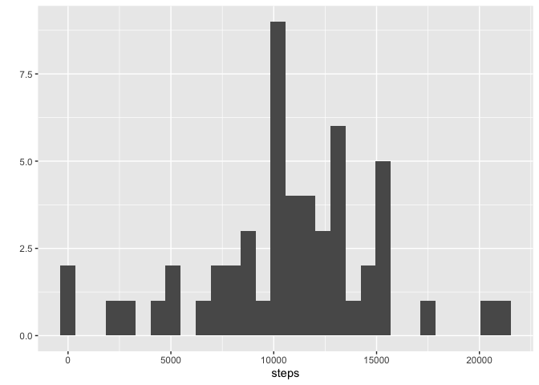
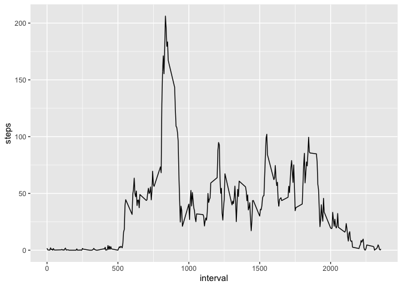
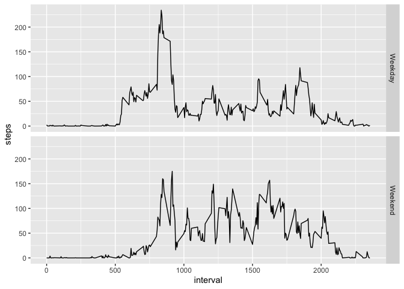

## This document is by Aibek Mursalimov
# New project was created with an appropriate working directory
# Required packages were loaded


```r
library(dplyr)
```

```
## 
## Attaching package: 'dplyr'
```

```
## The following objects are masked from 'package:stats':
## 
##     filter, lag
```

```
## The following objects are masked from 'package:base':
## 
##     intersect, setdiff, setequal, union
```

```r
library(ggplot2)
library(knitr)
```

## Loading and preprocessing the data

# For loading and reading the data


```r
knitr::opts_chunk$set(echo = TRUE)
unzip(zipfile = "activity.zip")
data_A <- read.csv("activity.csv")
str(data_A)
```

```
## 'data.frame':	17568 obs. of  3 variables:
##  $ steps   : int  NA NA NA NA NA NA NA NA NA NA ...
##  $ date    : Factor w/ 61 levels "2012-10-01","2012-10-02",..: 1 1 1 1 1 1 1 1 1 1 ...
##  $ interval: int  0 5 10 15 20 25 30 35 40 45 ...
```

```r
summary(data_A)
```

```
##      steps                date          interval     
##  Min.   :  0.00   2012-10-01:  288   Min.   :   0.0  
##  1st Qu.:  0.00   2012-10-02:  288   1st Qu.: 588.8  
##  Median :  0.00   2012-10-03:  288   Median :1177.5  
##  Mean   : 37.38   2012-10-04:  288   Mean   :1177.5  
##  3rd Qu.: 12.00   2012-10-05:  288   3rd Qu.:1766.2  
##  Max.   :806.00   2012-10-06:  288   Max.   :2355.0  
##  NA's   :2304     (Other)   :15840
```

```r
head(data_A)
```

```
##   steps       date interval
## 1    NA 2012-10-01        0
## 2    NA 2012-10-01        5
## 3    NA 2012-10-01       10
## 4    NA 2012-10-01       15
## 5    NA 2012-10-01       20
## 6    NA 2012-10-01       25
```

# To further process data and remove missing values


```r
knitr::opts_chunk$set(echo = TRUE)
data_B <- na.omit(data_A)
```

## What is mean total number of steps taken per day?

# Creating the summary


```r
knitr::opts_chunk$set(echo = TRUE)
data_C <- group_by(data_B, date)
data_C <- summarize(data_C, steps=sum(steps))
```

```
## `summarise()` ungrouping output (override with `.groups` argument)
```

```r
summary(data_C)
```

```
##          date        steps      
##  2012-10-02: 1   Min.   :   41  
##  2012-10-03: 1   1st Qu.: 8841  
##  2012-10-04: 1   Median :10765  
##  2012-10-05: 1   Mean   :10766  
##  2012-10-06: 1   3rd Qu.:13294  
##  2012-10-07: 1   Max.   :21194  
##  (Other)   :47
```

# To draw a histogram


```r
knitr::opts_chunk$set(echo = TRUE)
qplot(steps, data=data_C)
```

```
## `stat_bin()` using `bins = 30`. Pick better value with `binwidth`.
```

<!-- -->

# Calculating the mean and median


```r
knitr::opts_chunk$set(echo = TRUE)

mean(data_C$steps)
```

```
## [1] 10766.19
```

```r
median(data_C$steps)
```

```
## [1] 10765
```

## What is the average daily activity pattern?

# creating a new data frame with the intervals


```r
knitr::opts_chunk$set(echo = TRUE)
data_D <- group_by(data_B, interval)
data_D <- summarize(data_D, steps=mean(steps))
```

```
## `summarise()` ungrouping output (override with `.groups` argument)
```

# to create a histogram


```r
knitr::opts_chunk$set(echo = TRUE)

ggplot(data_D, aes(interval, steps)) + geom_line()
```

<!-- -->

# Calculating the max


```r
knitr::opts_chunk$set(echo = TRUE)

data_D[data_D$steps==max(data_D$steps),]
```

```
## # A tibble: 1 x 2
##   interval steps
##      <int> <dbl>
## 1      835  206.
```

## Imputing missing values

# processing data and filling missing values


```r
knitr::opts_chunk$set(echo = TRUE)
nrow(data_A)-nrow(data_B)
```

```
## [1] 2304
```

```r
names(data_D)[2] <- "mean.steps"
act.impute <- merge(data_A, data_B)

act.impute$steps[is.na(act.impute$steps)] <- act.impute$mean.steps[is.na(act.impute$steps)]

act.day.imp <- group_by(act.impute, date)
act.day.imp <- summarize(act.day.imp, steps=sum(steps))
```

```
## `summarise()` ungrouping output (override with `.groups` argument)
```

# creating a histogram


```r
knitr::opts_chunk$set(echo = TRUE)
qplot(steps, data=act.day.imp)
```

```
## `stat_bin()` using `bins = 30`. Pick better value with `binwidth`.
```

<!-- -->

# Calculating mean and median


```r
knitr::opts_chunk$set(echo = TRUE)
mean(act.day.imp$steps)
```

```
## [1] 10766.19
```

```r
median(act.day.imp$steps)
```

```
## [1] 10765
```


## Are there differences in activity patterns between weekdays and weekends?

# New data set

```r
knitr::opts_chunk$set(echo = TRUE)
act.impute$dayofweek <- weekdays(as.Date(act.impute$date))
act.impute$weekend <-as.factor(act.impute$dayofweek=="Saturday"|act.impute$dayofweek=="Sunday")
levels(act.impute$weekend) <- c("Weekday", "Weekend")

act.weekday <- act.impute[act.impute$weekend=="Weekday",]
act.weekend <- act.impute[act.impute$weekend=="Weekend",]

act.int.weekday <- group_by(act.weekday, interval)
act.int.weekday <- summarize(act.int.weekday, steps=mean(steps))
```

```
## `summarise()` ungrouping output (override with `.groups` argument)
```

```r
act.int.weekday$weekend <- "Weekday"
act.int.weekend <- group_by(act.weekend, interval)
act.int.weekend <- summarize(act.int.weekend, steps=mean(steps))
```

```
## `summarise()` ungrouping output (override with `.groups` argument)
```

```r
act.int.weekend$weekend <- "Weekend"

act.int <- rbind(act.int.weekday, act.int.weekend)
act.int$weekend <- as.factor(act.int$weekend)
```

# creating a plot


```r
knitr::opts_chunk$set(echo = TRUE)
ggplot(act.int, aes(interval, steps)) + geom_line() + facet_grid(weekend ~ .)
```

<!-- -->

